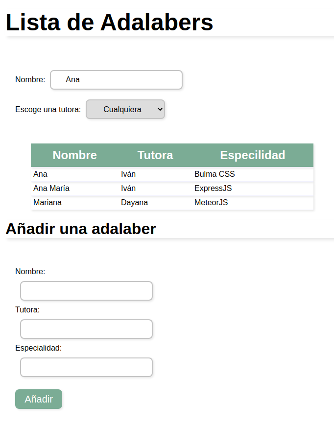
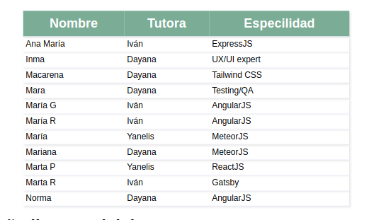
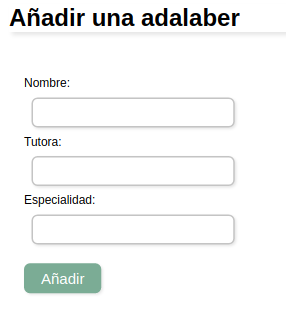
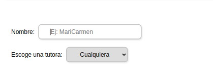

## ACTUALIZACIÓN Ejercicio
 
 Modificación del ejercicio, ya no recoge los datos de una API, he creado un servidor con Node Js.

### Cómo arrancar el backend

En la raíz del proyecto:

1. Ejecutar `npm install`.
1. Ejecutar `npm start` o `npm run dev`.

El backend se arrancará en http://localhost:4000

### Cómo ejecutar el frontend

En la raíz del proyecto:

1. Ejecutar `cd front`.
1. Ejecutar `npm install`.
1. Ejecutar `npm start` o `npm run dev`.
1. Abrir la página http://localhost:3000

## MÓDULO 3 EJERCICIO EVALUACIÓN INTERMEDIA

El ejercicio consiste en desarrollar una página web sencilla con React para poder gestionar un listado con todas las alumnas de la promo Olguin de Adalab.

------------------------------------------------

## Descripción y pasos del ejercicio :spiral_notepad:

Los requisitos que me pidieron para la aplicación web son:
#### Mostrar el listado de Adalabers

 - Usar una Api para recoger el listado de adalabers
 - Mostrar el resultado en una tabla

 

---------------------------------------------------

#### Añadir una nueva Adalaber

 - Crear un formulario con varios campos
 - Crear un botón de añadir

----------------------------------------------------

####  Filtrar el listado de Adalabers

- Por nombre: usando un input
- Por tutora: usando un select

-----------------------------------------------------

## Licencia  📄 

Este proyecto está bajo la Licencia MIT License mira el archivo [LICENSE](LICENSE) para más detalles

-------------------------------------------------------
## Autora: :woman_technologist:

Frontend developer **Patri Malvido** [Github](https://github.com/PatriMalvido)
