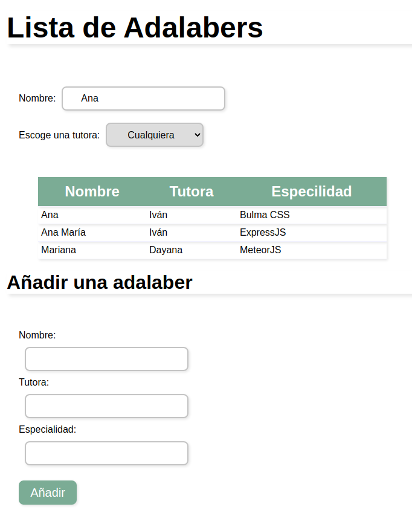
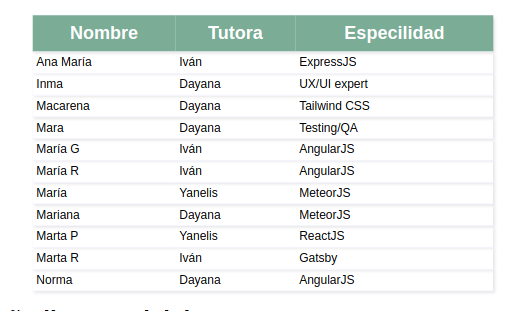
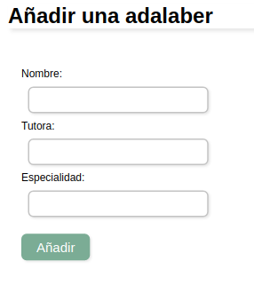

# MÓDULO 3 EJERCICIO EVALUACIÓN INTERMEDIA

El ejercicio consiste en desarrollar una página web sencilla con React para poder gestionar un listado con todas las alumnas de la promo Olguin de Adalab.

Para probarlo haz click [aquí](http://beta.adalab.es/modulo-3-evaluacion-intermedia-PatriMalvido/) y verás la página en funcionamiento.

------------------------------------------------

## Descripción y pasos del ejercicio :spiral_notepad:

Los requisitos que me pidieron para la aplicación web son:
#### Mostrar el listado de Adalabers

 - Usar una Api para recoger el listado de adalabers
 - Mostrar el resultado en una tabla

 

---------------------------------------------------

#### Añadir una nueva Adalaber

 - Crear un formulario con varios campos
 - Crear un botón de añadir

----------------------------------------------------

####  Filtrar el listado de Adalabers

- Por nombre: usando un input
- Por tutora: usando un select

-----------------------------------------------------

## Licencia  📄 

Este proyecto está bajo la Licencia MIT License mira el archivo [LICENSE](LICENSE) para más detalles

-------------------------------------------------------
## Autora: :woman_technologist:

Futura junior frontend developer **Patri Malvido** [Github](https://github.com/PatriMalvido)
